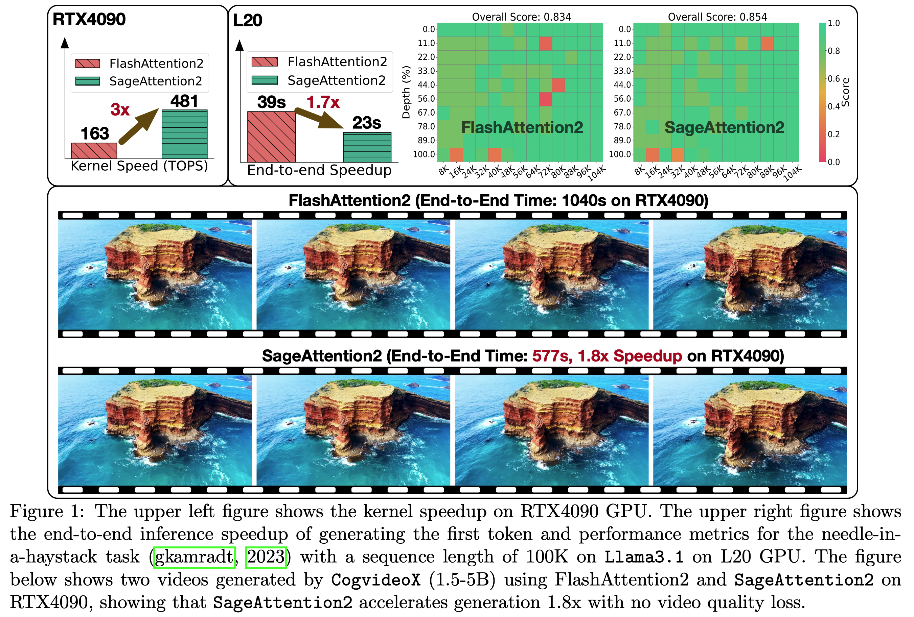

# Low-bit FlashAttention Accelerated Operator Design Based on Triton (PaddlePaddle Version)

[](https://openaccess.thecvf.com/content/ICCV2025W/ECLR/papers/Du_Low-bit_FlashAttention_Accelerated_Operator_Design_Based_on_Triton_ICCVW_2025_paper.pdf)
[](https://opensource.org/licenses/Apache-2.0)

This repository provides the **PaddlePaddle** implementation of low-bit FlashAttention, offering 2.4× kernel speedup and 1.2× end-to-end inference speedup compared to FlashAttention-2 while maintaining accuracy.

📌 **Project Paper**: [Low-bit FlashAttention Accelerated Operator Design Based on Triton](https://openaccess.thecvf.com/content/ICCV2025W/ECLR/papers/Du_Low-bit_FlashAttention_Accelerated_Operator_Design_Based_on_Triton_ICCVW_2025_paper.pdf) (ICCV 2025 Workshop)

## 🌟 Key Features

- **Mixed-precision Quantization**: Supports INT2/4/8 for QK^T and FP8/FP16 for PV
- **Operator Fusion**: Fuses dequantization with matrix multiplication to reduce memory access
- **Dynamic Quantization**: Allocates different bit widths based on importance
- **PaddlePaddle Native**: Full implementation using PaddlePaddle framework
- **Flexible Backends**: Both Triton and CUDA backends supported
- **Long Sequence Support**: Optimized for handling long sequences (8K-128K)

## 📊 Results

- **Kernel Speedup**: 2.4× faster than FlashAttention-2
- **End-to-end Inference**: 1.2× speedup with minimal accuracy degradation
- **Memory Efficiency**: Reduced memory footprint through operator fusion



## 🛠️ Installation

### Prerequisites

- Python ≥ 3.9
- PaddlePaddle nightly build
- CUDA ≥ 12.0 (CUDA ≥ 12.4 for FP8 support)
- Triton ≥ 3.0.0

### Setup Environment

```bash
# Clone the repository
git clone https://github.com/Charles2530/lowbit_quant_fa2_paddle.git
cd lowbit_quant_fa2_paddle

# Setup environment
bash script/setup_env.sh

# Install dependencies
pip install -e .
```

## 🚀 Quick Start

### Basic Usage

```python
import paddle
from src import sageattn_qk_int8_pv_fp16_triton

# Create input tensors (FP16/BF16)
batch_size, num_heads, seq_len, head_dim = 4, 32, 4096, 64
q = paddle.randn([batch_size, num_heads, seq_len, head_dim], dtype=paddle.float16)
k = paddle.randn([batch_size, num_heads, seq_len, head_dim], dtype=paddle.float16)
v = paddle.randn([batch_size, num_heads, seq_len, head_dim], dtype=paddle.float16)

# Run low-bit FlashAttention
output = sageattn_qk_int8_pv_fp16_triton(
    q=q, k=k, v=v,
    tensor_layout="HND",
    is_causal=False
)
```

### Available APIs

- `sageattn_qk_int8_pv_fp16_triton`: INT8 QK^T + FP16 PV (Triton backend)
- `sageattn_qk_int8_pv_fp8_cuda`: INT8 QK^T + FP8 PV (CUDA backend)
- `sageattn_qk_int8_pv_fp16_cuda`: INT8 QK^T + FP16 PV (CUDA backend)
- `sageattn_qk_int4_pv_fp16_triton`: INT4 QK^T + FP16 PV (Triton backend)

### Tensor Layout Options

- `tensor_layout="HND"`: Shape `(batch_size, head_num, seq_len, head_dim)`
- `tensor_layout="NHD"`: Shape `(batch_size, seq_len, head_num, head_dim)`

## 📁 Project Structure

```
lowbit_quant_fa2_paddle/
├── src/                          # Main source code
│   ├── core.py                   # Core API implementations
│   ├── quant.py                  # Quantization utilities
│   └── triton/                   # Triton kernels
│       ├── attn_qk_int8_per_block.py
│       ├── attn_qk_int4_per_block.py
│       ├── attn_qk_int2_per_block.py
│       ├── quant_per_block.py
│       ├── quant_per_thread.py
│       └── ...
├── csrc/                         # CUDA kernels
│   ├── qattn/                    # Quantized attention kernels
│   └── fused/                    # Fused operations
├── bench/                        # Benchmarking scripts
│   ├── baseline/                 # Baseline comparisons
│   ├── quant/                    # Quantization benchmarks
│   └── video_test/               # Video model tests
├── example/                      # Usage examples
│   ├── sageattn_cogvideo.py     # CogVideoX example
│   └── parallel_sageattn_cogvideo.py
├── script/                       # Utility scripts
│   ├── setup_env.sh             # Environment setup
│   └── run_triton_bench_*.sh    # Benchmark scripts
└── utils/                        # Utility functions
```

## 🔬 Benchmarking

### Run Benchmarks

```bash
# INT8 QK + FP16 PV benchmark
bash script/run_triton_bench_qk_int8.sh

# INT4 QK + FP16 PV benchmark
bash script/run_triton_bench_qk_int4.sh

# Mixed precision benchmark
bash script/run_triton_bench_q_int8_k_int4.sh
```

### Test on CogVideoX

```bash
cd example
python sageattn_cogvideo.py --compile
```

## 📈 Performance

*Detailed benchmark results coming soon. Check the `assets/` directory for GPU-specific performance graphs.*

## 📝 Citation

If you find this project useful, please cite our paper:

```bibtex
@inproceedings{du2025low,
  title={Low-bit FlashAttention Accelerated Operator Design Based on Triton},
  author={Du, Jinyang and Guo, Jinyang and Ding, Yifu},
  booktitle={Proceedings of the IEEE/CVF International Conference on Computer Vision Workshops (ICCVW)},
  year={2025}
}
```

## 🙏 Acknowledgments

This work was supported by:
- Beijing Municipal Science and Technology Project (No. Z231100010323002)
- National Natural Science Foundation of China (Nos. 62306025, 92367204)
- CCF-Baidu Open Fund

## 📄 License

This project is licensed under the Apache License 2.0 - see the [LICENSE](LICENSE) file for details.

## 🔗 Related Work

This is the PaddlePaddle implementation of the low-bit FlashAttention work. The PyTorch version is available at:
- [SageAttention (THU-ML)](https://github.com/thu-ml/SageAttention)

## 📧 Contact

For questions or issues, please open an issue on GitHub or contact:
- Yifu Ding: yifuding@buaa.edu.cn

---

**Star ⭐ and Watch 👀 this repository to stay updated!**
