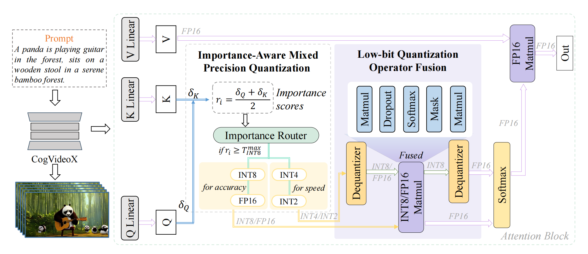
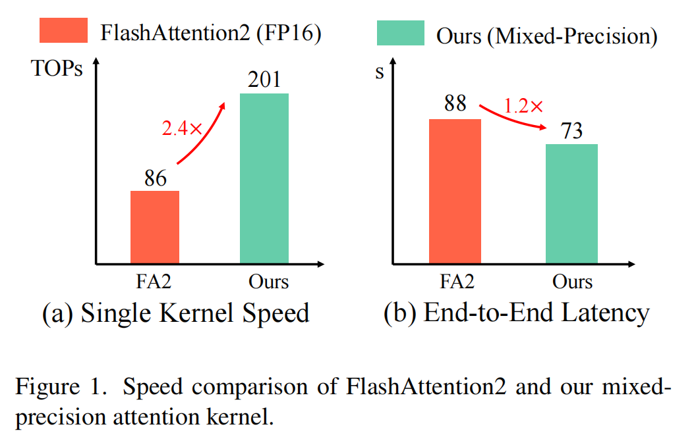

# Low-bit FlashAttention Accelerated Operator Design Based on Triton (PaddlePaddle Version)

[](https://openaccess.thecvf.com/content/ICCV2025W/ECLR/papers/Du_Low-bit_FlashAttention_Accelerated_Operator_Design_Based_on_Triton_ICCVW_2025_paper.pdf)
[](https://opensource.org/licenses/Apache-2.0)

This repository provides the **PaddlePaddle** implementation of low-bit FlashAttention operators, focusing on operator-level acceleration via Triton. We leverage mixed-precision low-bit quantization for QK^T and fused dequantization with matmul for PV to improve compute intensity and reduce memory traffic — delivering up to 2.4× kernel speedup and 1.2× end-to-end speedup over FlashAttention-2 while maintaining accuracy.



📌 **Project Paper**: [Low-bit FlashAttention Accelerated Operator Design Based on Triton](https://openaccess.thecvf.com/content/ICCV2025W/ECLR/papers/Du_Low-bit_FlashAttention_Accelerated_Operator_Design_Based_on_Triton_ICCVW_2025_paper.pdf) (ICCV 2025 Workshop)

## 🌟 Key Features (Paddle Operator Version)

- **Operator-focused design**: PaddlePaddle-native low-bit FlashAttention operators built on Triton
- **Mixed-precision quantization**: INT2/4/8 for QK^T, FP16/FP8 for PV
- **Operator fusion**: Dequantization fused with GEMM to minimize global memory access
- **Dynamic bit allocation**: Allocate different bit widths based on token importance
- **Flexible backends**: Triton and CUDA backends for different deployment scenarios
- **Long sequence support**: Optimized kernels for 8K–128K contexts

## 📊 Results

- **Kernel speedup**: Up to 2.4× vs FlashAttention-2
- **End-to-end speedup**: ~1.2× with minimal accuracy impact
- **Memory efficiency**: Reduced footprint through fusion and low-bit storage



## 🛠️ Installation

### Prerequisites

- Python ≥ 3.9
- PaddlePaddle nightly build (GPU)
- CUDA ≥ 12.0 (≥ 12.4 recommended for FP8)
- Triton ≥ 3.0.0

### Setup Environment

```bash
# Clone the repository
git clone https://github.com/Charles2530/lowbit_quant_fa2_paddle.git
cd lowbit_quant_fa2_paddle

# Setup environment (creates conda env, installs Triton/Paddle deps)
bash script/setup_env.sh

# Install dependencies
pip install -e .
```

If you are familiar with the PyTorch version, this PaddlePaddle repo mirrors the operator design and benchmarking methodology but implements all execution paths and APIs using Paddle tensors and runtime.

## 🚀 Quick Start

### Basic Usage (Paddle tensors)

```python
import paddle
from src import (
    lowbit_fa_qk_int8_pv_fp16_triton,
    lowbit_fa_qk_int4_pv_fp16_triton,
)

# Create input tensors (FP16/BF16)
batch_size, num_heads, seq_len, head_dim = 4, 32, 4096, 64
q = paddle.randn([batch_size, num_heads, seq_len, head_dim], dtype=paddle.float16)
k = paddle.randn([batch_size, num_heads, seq_len, head_dim], dtype=paddle.float16)
v = paddle.randn([batch_size, num_heads, seq_len, head_dim], dtype=paddle.float16)

# Run low-bit FlashAttention (INT8 QK^T + FP16 PV via Triton)
output_int8 = lowbit_fa_qk_int8_pv_fp16_triton(
    q=q, k=k, v=v,
    tensor_layout="HND",
    is_causal=False
)

# Run INT4 QK^T + FP16 PV via Triton
output_int4 = lowbit_fa_qk_int4_pv_fp16_triton(
    q=q, k=k, v=v,
    tensor_layout="HND",
    is_causal=False
)
```

### Tensor Layout Options

- `tensor_layout="HND"`: Shape `(batch_size, head_num, seq_len, head_dim)`
- `tensor_layout="NHD"`: Shape `(batch_size, seq_len, head_num, head_dim)`

Both layouts are supported natively in Paddle kernels; choose based on your model’s internal representation.

## 📁 Project Structure

```
lowbit_quant_fa2_paddle/
├── src/                          # Main source code
│   ├── core.py                   # Core API implementations
│   ├── quant.py                  # Quantization utilities
│   └── triton/                   # Triton kernels
│       ├── attn_qk_int8_per_block.py
│       ├── attn_qk_int4_per_block.py
│       ├── attn_qk_int2_per_block.py
│       ├── quant_per_block.py
│       ├── quant_per_thread.py
│       └── ...
├── csrc/                         # CUDA kernels
│   ├── qattn/                    # Quantized attention kernels
│   └── fused/                    # Fused operations
├── bench/                        # Benchmarking scripts
│   ├── baseline/                 # Baseline comparisons
│   ├── quant/                    # Quantization benchmarks
│   └── video_test/               # Video model tests
├── example/                      # Usage examples
│   ├── sageattn_cogvideo.py     # CogVideoX example
│   └── parallel_sageattn_cogvideo.py
├── script/                       # Utility scripts
│   ├── setup_env.sh             # Environment setup
│   └── run_triton_bench_*.sh    # Benchmark scripts
└── utils/                        # Utility functions
```

## 🔬 Benchmarking

### Run Benchmarks (Paddle)

```bash
# INT8 QK + FP16 PV benchmark
bash script/run_triton_bench_qk_int8.sh

# INT4 QK + FP16 PV benchmark
bash script/run_triton_bench_qk_int4.sh

# Mixed precision benchmark
bash script/run_triton_bench_q_int8_k_int4.sh
```

All benchmarking scripts create inputs as Paddle tensors and call the Paddle-native Triton/CUDA kernels. Results are reported in TFLOP/s and latency.

### Test on CogVideoX (Paddle)

```bash
cd example
python sageattn_cogvideo.py --compile
```

## 📈 Performance

Detailed GPU-specific graphs will be available in `assets/`. The design mirrors the PyTorch version’s operator principles while maintaining PaddlePaddle execution and APIs.

## 📝 Citation

If you find this project useful, please cite our paper:

```bibtex
@inproceedings{du2025low,
  title={Low-bit FlashAttention Accelerated Operator Design Based on Triton},
  author={Du, Jinyang and Guo, Jinyang and Ding, Yifu},
  booktitle={Proceedings of the IEEE/CVF International Conference on Computer Vision Workshops (ICCVW)},
  year={2025}
}
```

## 🙏 Acknowledgments

This work was supported by:
- Beijing Municipal Science and Technology Project (No. Z231100010323002)
- National Natural Science Foundation of China (Nos. 62306025, 92367204)
- CCF-Baidu Open Fund

## 📄 License

This project is licensed under the Apache License 2.0 - see the [LICENSE](LICENSE) file for details.

## 🔗 Related Work

This is the PaddlePaddle implementation of the low-bit FlashAttention work. The PyTorch version is available at:
- [SageAttention (THU-ML)](https://github.com/thu-ml/SageAttention)

---

**Star ⭐ and Watch 👀 this repository to stay updated!**
